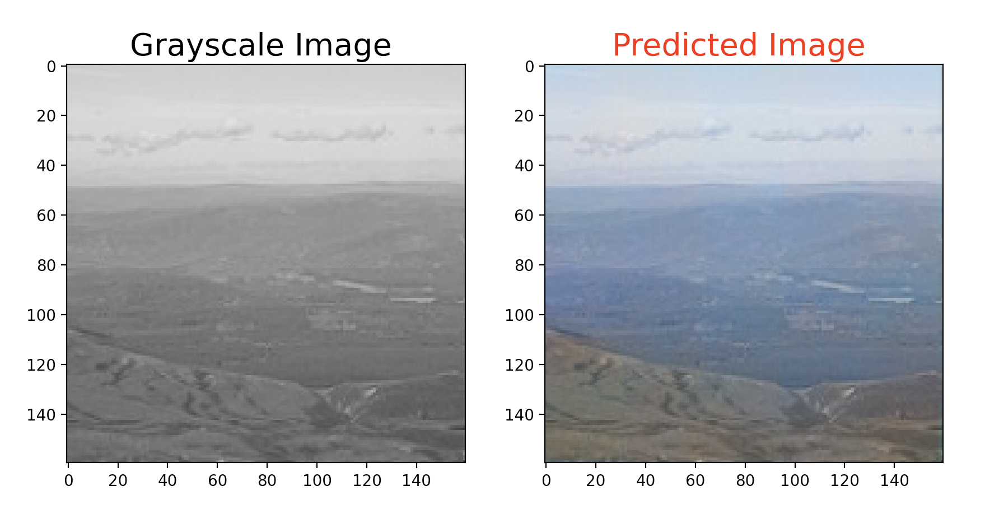

# ColorVAE

ColorVAE is a Vanilla Auto Encoder (V.A.E.) which can be used to add colours to black and white images. The model was trained using 7,129 landscape images of dimensions (160,160,3). If you want to try out the model yourself, feel free to email me and I can share the training weights directly. To test the model, simply follow these three steps:

1. Clone this repository in your IDE of choice using:
``` git clone https://github.com/nandiniigarg/ColorVAE/ ```
2. Save a grayscale and RGB version of an image of size 160x160 pixels in the same folder and rename them as "img_c.jpg" for RGB version and "img_g.jpg" for the grayscale version.
3. Simpy run the following command in your terminal:
``` python testrun.py ```

The result for me looked something like this:



This project was trained solely on landscape images dataset due to hardware limitations and thus currently works well for landscape images. Therefore, I plan on improving this project with time by using transfer learning on the pre-trained model using various datasets and fine tuning the training for each respective dataset. 

I am open for discussions on this project. Just open an issue and we can discuss any suggestions, bugs limitations. :)
